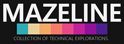
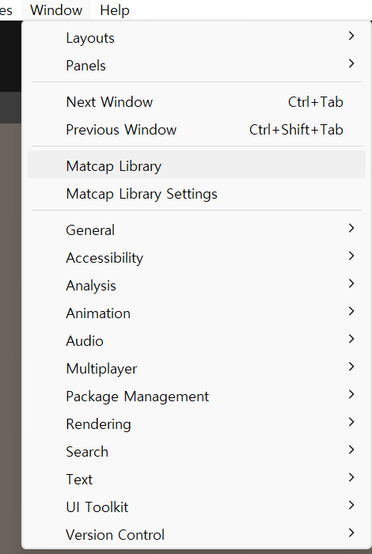
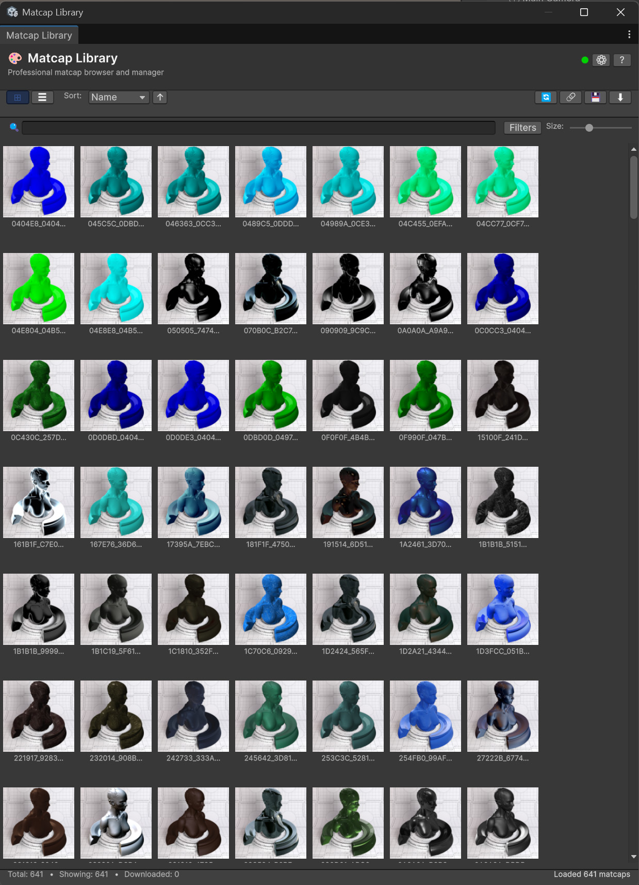

# Matcap Library for Unity

<p align="center">
  
</p>

<p align="center">
  <strong>Professional MatCap Browser & Manager for Unity</strong><br/>
  A powerful Unity Editor extension for browsing, downloading, and managing MatCap textures
</p>

<p align="center">
  <a href="#features">Features</a> •
  <a href="#installation">Installation</a> •
  <a href="#usage">Usage</a> •
  <a href="#keyboard-shortcuts">Shortcuts</a> •
  <a href="#cache-system">Cache System</a> •
  <a href="#license">License</a>
</p>

---

## 📋 Overview

**Matcap Library**는 Unity 프로젝트를 위한 전문적인 MatCap 텍스처 브라우저 및 관리 도구입니다. [nidorx/matcaps](https://github.com/nidorx/matcaps) 레포지토리에서 600개 이상의 고품질 MatCap 텍스처를 직접 다운로드하고 관리할 수 있습니다.

MatCap (Material Capture)은 3D 오브젝트에 실시간으로 복잡한 재질과 조명 효과를 표현할 수 있는 효율적인 렌더링 기법입니다. 이 도구를 사용하면 Unity 에디터 내에서 손쉽게 MatCap 라이브러리를 탐색하고 프로젝트에 적용할 수 있습니다.

---

## ✨ Features

### 🎨 **직관적인 UI/UX**
- **다크 테마** 기반의 모던한 인터페이스
- **그리드 뷰** 및 **리스트 뷰** 전환 지원
- 실시간 **검색 및 필터링**
- 드래그 가능한 **썸네일 크기 조절**
- 선택 및 호버 상태 시각적 피드백

### 🚀 **강력한 다운로드 기능**
- GitHub API 및 페이지 스크래핑을 통한 자동 MatCap 목록 로드
- **1024px 고정 해상도** 다운로드로 최적의 품질 보장
- 개별 또는 일괄 다운로드 지원
- 다운로드 진행 상태 실시간 표시
- 자동 파일 이름 관리 (Matcap_ 접두사)

### 💾 **스마트 캐싱 시스템**
- 프리뷰 이미지 자동 캐싱 (7일 유효기간)
- 빠른 로딩 속도
- 캐시 통계 및 관리 기능
- 만료된 캐시 자동 정리

### 🔧 **편리한 통합 기능**
- Unity Material 자동 생성
- Project 창에서 바로 찾기
- 텍스처 임포트 설정 자동 적용
- 컨텍스트 메뉴를 통한 빠른 작업

### ⚡ **고급 기능**
- 다중 정렬 옵션 (이름, 크기, 다운로드 상태)
- 연결 테스트 및 디버깅 도구
- 키보드 단축키 지원
- 오프라인 캐시 지원

---

## 📦 Installation

### 방법 : 직접 설치 필요

1. 이 레포지토리를 클론하거나 다운로드합니다
2. `Assets/Editors/Matcap Browser` 폴더를 Unity 프로젝트의 `Assets` 폴더에 복사합니다
3. Unity가 자동으로 스크립트를 컴파일합니다

---

## 🎯 Usage

### 윈도우 열기

Unity 에디터 상단 메뉴에서 **`Window`** > **`Matcap Library`**를 선택합니다.

<p align="center">
  
</p>

### 메인 인터페이스

<p align="center">
  
</p>

인터페이스는 다음 영역으로 구성됩니다:

1. **헤더**: 제목, 연결 상태 표시, 설정 및 도움말 버튼
2. **툴바**: 뷰 모드, 정렬 옵션, 빠른 작업 버튼
3. **검색 바**: 실시간 검색 및 필터, 썸네일 크기 조절
4. **콘텐츠 영역**: MatCap 썸네일 그리드/리스트
5. **상태 바**: 통계 정보 및 상태 메시지

### 기본 작업

#### MatCap 다운로드
- **더블 클릭**: MatCap을 더블 클릭하여 다운로드
- **우클릭 메뉴**: 컨텍스트 메뉴에서 "Download" 선택
- **일괄 다운로드**: 툴바의 "Download All" 버튼으로 모든 MatCap 다운로드

#### MatCap 검색
1. 검색 바에 텍스트 입력
2. 실시간으로 필터링된 결과 확인
3. "Clear" 버튼으로 검색 초기화

#### Material 생성
1. 다운로드한 MatCap을 우클릭
2. "Create Material" 선택
3. 자동으로 Material이 생성되고 Project 창에서 선택됨

---

## Settings

**`Window`** > **`Matcap Library Settings`** 또는 메인 창의 "Settings" 버튼을 클릭하여 설정 창을 엽니다.

### 일반 설정
- **Download Path**: MatCap 파일이 저장될 경로 (기본값: `Assets/Matcaps`)
- **Resolution**: 다운로드 해상도 (1024px 고정)
- **Thumbnail Size**: 그리드 뷰에서 썸네일 크기

### 캐시 설정
- **Cache Location**: 캐시 파일 저장 위치 (`Library/MatcapCache`)
- **Cache Statistics**: 캐시된 항목 수, 크기, 유효/만료 상태
- **Cache Management**: 캐시 정보 보기, 폴더 열기, 캐시 삭제

### 고급 설정
- **Source Repository**: MatCap 소스 레포지토리 정보
- **Test Connection**: GitHub 연결 테스트
- **Force Refresh**: MatCap 목록 강제 새로고침

---

## ⌨️ Keyboard Shortcuts

| 단축키 | 기능 |
|--------|------|
| `F5` | MatCap 목록 새로고침 |
| `Esc` | 선택 해제 / 패널 닫기 |
| `Tab` | 그리드 뷰 ↔ 리스트 뷰 전환 |

---

## Toolbar Actions

| 버튼 | 기능 | 설명 |
|------|------|------|
| Grid | Grid View | 그리드 레이아웃으로 MatCap 표시 |
| List | List View | 상세 리스트로 MatCap 표시 |
| Refresh | Refresh | GitHub에서 MatCap 목록 다시 로드 |
| Test | Test Connection | GitHub 연결 상태 확인 |
| Cache | Cache Info | 캐시 정보 및 통계 표시 |
| Download All | Download All | 사용 가능한 모든 MatCap 다운로드 |

---

## 💾 Cache System

### 자동 캐싱
- 프리뷰 이미지는 `Library/MatcapCache`에 자동으로 캐싱됩니다
- 캐시는 **7일 후** 자동으로 만료됩니다
- 캐싱된 이미지는 다음 사용 시 즉시 로드되어 빠른 성능을 제공합니다

### 캐시 관리
- **캐시 정보 보기**: 총 캐시 크기, 항목 수, 유효/만료 상태
- **만료된 캐시 정리**: 수동으로 만료된 항목 삭제
- **전체 캐시 삭제**: 모든 캐시 삭제 (프리뷰를 다시 다운로드)

---

## 🔍 Context Menu Options

MatCap을 우클릭하면 다음 옵션이 표시됩니다:

- **Download**: MatCap 다운로드 (또는 재다운로드)
- **Show in Project**: Project 창에서 파일 찾기
- **Create Material**: 이 MatCap을 사용하는 Material 생성
- **Copy Name**: MatCap 이름 클립보드에 복사
- **Copy URL**: GitHub 원본 URL 클립보드에 복사

---

## 🛠️ Technical Details

### 시스템 요구사항
- **Unity 버전**: 2020.3 이상 권장
- **인터넷 연결**: MatCap 다운로드 및 목록 로드에 필요
- **.NET 버전**: .NET Standard 2.0 이상

### 다운로드 소스
- **Primary**: GitHub API (`api.github.com/repos/nidorx/matcaps`)
- **Fallback**: GitHub 페이지 스크래핑
- **Raw Files**: `raw.githubusercontent.com/nidorx/matcaps/master/`

### 파일 구조
```
Assets/
└── Editors/
    └── Matcap Browser/
        ├── MatcapLibraryWindow.cs        # 메인 윈도우 및 로직
        └── MatcapLibraryWindow.cs.meta

Library/
└── MatcapCache/                          # 자동 생성
    ├── cache_index.json                  # 캐시 인덱스
    └── preview_*.png                     # 캐싱된 프리뷰 이미지

Assets/Matcaps/                           # 기본 다운로드 경로
└── Matcap_*.png                          # 다운로드된 MatCap 파일
```

---

## 🐛 Troubleshooting

### "Network error: Unable to connect to GitHub"
- 인터넷 연결을 확인하세요
- 방화벽 설정에서 Unity의 네트워크 액세스를 허용했는지 확인하세요
- 툴바의 "Test" 버튼으로 연결 테스트를 실행하세요
- VPN 사용 시 GitHub 접근이 가능한지 확인하세요

### 프리뷰가 로드되지 않음
- 캐시를 삭제하고 다시 시도하세요 (Settings > Clear All Cache)
- 연결 테스트를 실행하여 GitHub API 접근 가능 여부 확인

### 다운로드 실패
- Console 창에서 상세한 오류 메시지 확인
- 파일 이름에 특수 문자가 포함되어 있는지 확인
- 다운로드 경로가 유효하고 쓰기 권한이 있는지 확인

---

## 📝 License

이 프로젝트는 MIT 라이선스 하에 배포됩니다. 자세한 내용은 [LICENSE](LICENSE) 파일을 참조하세요.

### MatCap Source
MatCap 텍스처는 [nidorx/matcaps](https://github.com/nidorx/matcaps) 레포지토리에서 제공됩니다.  
각 텍스처의 라이선스는 원본 레포지토리를 참조하세요.

---

## 🤝 Contributing

기여를 환영합니다! 다음과 같은 방법으로 프로젝트에 기여할 수 있습니다:

1. 이슈 리포팅
2. 기능 제안
3. Pull Request 제출
4. 문서 개선

---

## 📧 Support

문제가 발생하거나 질문이 있으신 경우:

- **GitHub Issues**: 버그 리포트 및 기능 요청
- **Discussions**: 일반적인 질문 및 토론
- **Email**: mazeline@mazeline.tech

---

## 👥 Developer & Company

### Mazeline
**Collection of Technical Explorations**

Mazeline은 기술 탐구와 혁신적인 도구 개발에 전념하는 개발 팀입니다.  
Unity 에디터 확장, 3D 그래픽스, 게임 개발 도구를 중심으로 다양한 프로젝트를 진행하고 있습니다.

- **Website**: [mazeline.tech](https://mazeline.tech)
- **Email**: mazeline@mazeline.tech

### 개발자
- **Developer**: jplee
- **Contact**: mazeline@mazeline.tech

### 주요 프로젝트
- Matcap Library for Unity - MatCap 텍스처 브라우저 및 관리 도구
- Unity Editor Extensions - 생산성 향상을 위한 에디터 도구 모음
- 3D Graphics Tools - 실시간 렌더링 및 셰이더 유틸리티

---

## 🙏 Credits

- **MatCap Textures**: [nidorx/matcaps](https://github.com/nidorx/matcaps)
- **Developer**: jplee
- **Company**: Mazeline - Collection of Technical Explorations
- **Built with**: Unity Editor Extensions & C#

---

## 📊 Stats

- **600+** MatCap 텍스처 지원
- **1024px** 고해상도 다운로드
- **7-day** 스마트 캐싱
- **2** 뷰 모드 (그리드/리스트)
- **3** 정렬 옵션

---

<p align="center">
  Made with ❤️ by <strong>Mazeline</strong>
</p>

